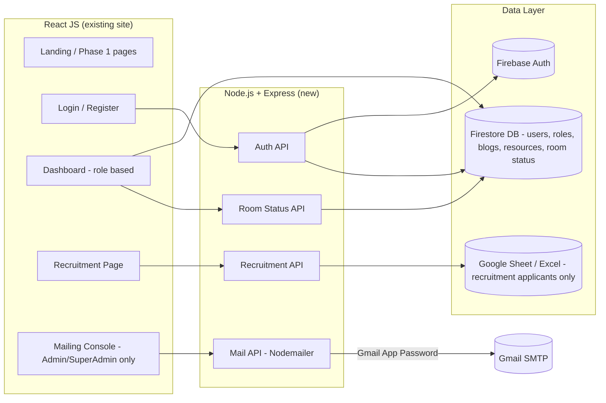
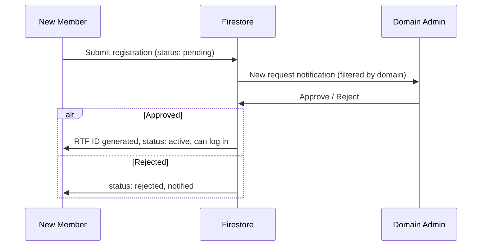

# The Robo-Tech Forum (RTF) — Phase 2 Development Brief

**Prepared for:** RTF Development Team (20 members) 
**Prepared from:** Captain's brief, phase 2 scope 
**Stack:** React JS (frontend) + Node.js/Express (backend, new) + Firebase (Firestore + Auth) + Google Sheets/Excel (recruitment data) + Nodemailer

---

## 1. What Phase 2 Adds

Phase 1 was a static informational site (landing, services, achievements). Phase 2 turns it into a real application with accounts, roles, an internal dashboard, a digitized recruitment pipeline, and a bulk-mailing tool. It has **4 modules**:

| # | Module | One-line goal |
|---|--------|----------------|
| 1 | Auth & RBAC | Register/login as Super Admin, Admin, or Member; auto-generate RTF IDs |
| 2 | Recruitment Node | Public page where new (not-yet-member) students apply; goes to Excel/Sheets, not Firebase |
| 3 | Member Dashboard | Resources, Blogs, RTF Room open/close toggle |
| 4 | Mailing Module | Admin sends filtered, bulk email via Nodemailer + Gmail App Password |

---

## 2. Roles & Permissions

```
Super Admin
 └─ full access to everything: approve/reject admins, all domains, send mail to anyone,
    post recruitment announcements, manage RTF room status override, view all data

Admin (Domain Head — one per domain)
 └─ approves/rejects Member registrations ONLY within their own domain
 └─ sends mail to their own domain's members
 └─ manages Resources/Blogs for their domain

Member
 └─ views dashboard (Resources, Blogs)
 └─ toggles RTF Room status (Open/Closed)
 └─ receives mail, updates own profile
```

**Domains (confirm with Captain — see Open Questions, §10):**
- Software Domain
- Electrical Domain
- Aeronautics & Mechanical Domain *(brief mentioned these as one combined domain earlier, then gave three separate-sounding codes — needs confirmation)*

---

## 3. System Architecture



---

## 4. Module 1 — Auth & RBAC

### 4.1 Registration fields (collected once, at sign-up)

| Field | Notes |
|---|---|
| Full Name | |
| College Enrollment Number | |
| College Email ID | |
| Personal Email ID | backup contact |
| Branch | |
| Year of Passing | used in ID generation |
| Phone Number | |
| Domain | dropdown: Software / Electrical / Aeronautics & Mechanical |
| Role requested | Member (default) — Admin/Super Admin accounts are created manually, not self-registered |

### 4.2 RTF ID auto-generation

Format: **`{DomainCode}{YY}{Serial}@RTF`**

Example: `SD2701@RTF`

| Segment | Meaning | Example |
|---|---|---|
| `SD` | Domain code | SD = Software, ED = Electrical, AMD = Aero+Mech *(placeholder — confirm)* |
| `27` | Last 2 digits of Year of Passing | 2027 → `27` |
| `01` | Serial number, per domain+year, zero-padded | 1st registrant → `01` |
| `@RTF` | Fixed suffix | — |

**Logic (pseudocode):**
```
function generateRTFID(domain, yearOfPassing):
    code = DOMAIN_CODE_MAP[domain]         // SD / ED / AMD
    yy = last2digits(yearOfPassing)
    serial = countExistingUsers(domain, yearOfPassing) + 1
  &#160;&#160;&#160;&#160;serial = padZero(serial, 2)     // 01, 02, 03...
    return `${code}${yy}${serial}@RTF`
```
This counter must be atomic (use a Firestore transaction on a counter doc per `domain_year`) so two simultaneous registrations never get the same serial number.

### 4.3 Approval workflow



- A Member's request is only ever visible to the **Admin of the same domain** they chose.
- Only after approval does the account become login-capable and land on the Dashboard.

### 4.4 Firestore `users` collection (suggested schema)

```json
{
  "uid": "auto",
  "name": "",
  "collegeEnrollmentNo": "",
  "collegeEmail": "",
  "personalEmail": "",
  "branch": "",
  "yearOfPassing": 2027,
  "phone": "",
  "domain": "software",
  "role": "member",           // "member" | "admin" | "superadmin"
  "rtfId": "SD2701@RTF",
  "status": "pending",        // "pending" | "active" | "rejected"
  "roomTogglePermission": true,
  "createdAt": "timestamp",
  "approvedBy": "adminUid or null"
}
```

---

## 5. Module 2 — Recruitment Node

This is the digitized new-member intake pipeline. It's a **separate public-facing page**, distinct from the login-gated site.

### 5.1 Page layout
- **Left/main:** Announcement section — Super Admin posts phase updates (e.g. "Round 1 results out", "Technical round on 14th").
- **Right corner:** Application form.

### 5.2 Form fields
Same idea as §4.1, but applicants are pre-enrollment students who **don't yet have a college enrollment number or college email**. So:

| Field | Notes |
|---|---|
| Full Name | |
| Temporary ID | auto-generated (see 5.3), shown to applicant as a reference number |
| Personal Email ID | required, since college email doesn't exist yet |
| Branch (expected) | |
| Expected Year of Passing | |
| Phone Number | |
| Domain applying to | Software / Electrical / Aero+Mech |

### 5.3 Temporary RTF ID
Same format as §4.2, but must be visually distinguishable as temporary until an admin converts it, e.g.:

`SD27-T01@RTF` (note the `-T` marker)

On approval, admin fills in the real enrollment number/college email, and the system re-issues the **permanent** ID (`SD2701@RTF`) and moves the record into the main `users` Firestore collection. Until then it lives only in the recruitment sheet (§6).

### 5.4 API endpoints (recruitment)

| Method | Route | Purpose |
|---|---|---|
| GET | `/api/recruitment/announcements` | Fetch current announcements |
| POST | `/api/recruitment/announcements` | Super Admin posts new announcement |
| POST | `/api/recruitment/apply` | Applicant submits form → appended to sheet |
| GET | `/api/recruitment/applicants` | Admin/Super Admin views applicants (filtered by domain) |
| POST | `/api/recruitment/convert/:id` | Converts a temp applicant into a permanent Firestore user |

---

## 6. Module 3 — Member Dashboard

Post-login, a Member sees:

- **Resources** — shared files/links (Firestore-backed list, domain-specific).
- **Blogs** — posts/updates written by members or admins.
- **RTF Room status toggle** — Open / Closed switch.
  - When a member flips it, write `roomStatus: { state: "open", updatedBy: uid, updatedAt: ts }` to a single Firestore doc, e.g. `system/roomStatus`.
  - **Reflect this** on: the Super Admin/Admin dashboards (live), and optionally as a small live badge on the public landing page ("RTF Room: Open now").

---

## 7. Module 4 — Mailing Module

- Admin/Super Admin opens a **Mail Console**.
- Can filter recipients: by domain, by name search, or select individually.
- Compose: subject, body (rich text optional), attachment upload.
- Backend batches sends via **Nodemailer** using a **Gmail App Password**.
- **Important constraint to flag to the team:** a personal Gmail account has a daily sending cap (roughly 500/day for a regular Gmail account, lower on new accounts; Google Workspace accounts get more). The brief mentioned ~100–150 mails per run — stay well under Gmail's limits and **batch with a short delay between sends** (e.g. 1 email every 1–2 seconds) to avoid being flagged as spam.
- Log every send (recipient, subject, timestamp, status) to a Firestore `mailLogs` collection for accountability/debugging.

### API endpoints (mailing)

| Method | Route | Purpose |
|---|---|---|
| GET | `/api/mail/recipients?domain=&search=` | Get filterable recipient list |
| POST | `/api/mail/send` | Send bulk mail (subject, body, attachments, recipientIds) |
| GET | `/api/mail/logs` | View send history |

---

## 8. Data Storage Strategy — Firebase vs Sheet

This is a key architectural decision, so the whole team should understand **why** the split exists:

- **Firestore** → all app data: users, roles, approvals, blogs, resources, room status, mail logs.
- **Recruitment applicants** → NOT Firestore. Goes into a spreadsheet, because recruitment data is temporary, needs to be easily reviewed/sorted by non-technical seniors, and gets manually triaged before becoming "real" member data.

**Recommendation for the team:** instead of writing to a local `.xlsx` file on the server (which breaks on most free hosting because the filesystem isn't persistent/shared across instances), use the **Google Sheets API** from the Node backend. Effect is the same as "goes to Excel," but it's live, shareable, and doesn't get wiped on redeploy. If the Captain specifically wants a downloadable `.xlsx` instead, that's easy to add as an "Export" button that reads the Sheet and generates a file on demand — best of both.

---

## 9. Suggested Repo Structure

```
rtf-website/
├── frontend/                # existing React app, extended
│   ├── src/pages/Login/
│   ├── src/pages/Register/
│   ├── src/pages/Dashboard/
│   ├── src/pages/Recruitment/
│   ├── src/pages/MailConsole/
│   └── src/components/
├── backend/                 # new Node/Express service
│   ├── routes/auth.js
│   ├── routes/recruitment.js
│   ├── routes/mail.js
│   ├── routes/room.js
│   ├── services/idGenerator.js
│   ├── services/sheetsService.js
│   ├── services/mailer.js
│   └── config/firebaseAdmin.js
└── docs/                    # this doc + diagrams live here
```

---

## 10. Open Questions to Confirm With the Captain Before Coding Starts

1. **Domain codes** — the brief said "SD" for Software, then "ND" for Mechanical, then "ED" for Electrical *and* Aeronautics. Since Aeronautics+Mechanical was also described as one combined domain, please confirm: is it 3 domains (Software / Electrical / Aero+Mech) or 4? And confirm the exact 2-letter code for each.
2. Should the **public landing page** show live RTF Room status, or is that internal-only (dashboard only)?
3. For recruitment: should the "Export to Excel" happen automatically per submission, or as an on-demand export button for the admin?
4. Should rejected Members/Applicants be permanently deleted, or kept with a `rejected` status for records?
5. Any existing Google Workspace / domain email for RTF (for Sheets API + Nodemailer), or should this run off a personal Gmail with an App Password?

---

## 11. How to Split This Across 20 Beginners (GitHub-Issue Workflow)

Suggested team split (roughly 5 people per module, mixing frontend/backend so everyone gets full-stack exposure):

| Squad | Module | Sample first issues |
|---|---|---|
| Squad A | Auth & RBAC | `#1 Design login/register UI`, `#2 Firebase Auth integration`, `#3 ID-generator service + unit test`, `#4 Approval workflow API` |
| Squad B | Recruitment Node | `#5 Announcement UI`, `#6 Application form UI`, `#7 Google Sheets API write endpoint`, `#8 Temp-ID → permanent-ID conversion` |
| Squad C | Dashboard | `#9 Resources page`, `#10 Blogs CRUD`, `#11 Room status toggle + live badge` |
| Squad D | Mailing | `#12 Mail console UI + attachment upload`, `#13 Nodemailer batch-send service`, `#14 Send-rate limiting + logging` |

**Process for the team (mention this in the meeting):**
1. Every task above becomes a GitHub Issue with a checklist and the module's section number from this doc linked.
2. Members assign themselves to an issue, branch off `dev` (`feature/#issue-number-short-name`), and open a PR back to `dev` when done.
3. PRs get reviewed by the squad lead before merge — this is what makes the "cross-verifiable on resume/LinkedIn" claim work: the commit history and merged PR are public proof of contribution.
4. Once a module's issues are all merged, tag it and move to integration testing.

---

## 12. Recap: What Members Get

- Real, shipped, open-source contributions with public commit history (LinkedIn/resume-verifiable).
- E-certificates on completion.
- A virtual badge.

---

*This document is a working brief derived from the Captain's verbal walkthrough — section 10 lists the points that need a quick confirmation before development starts, everything else is ready to build against.*